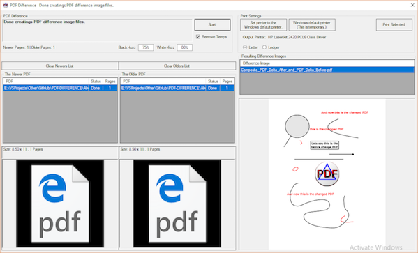
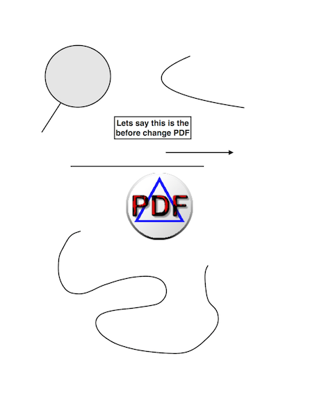
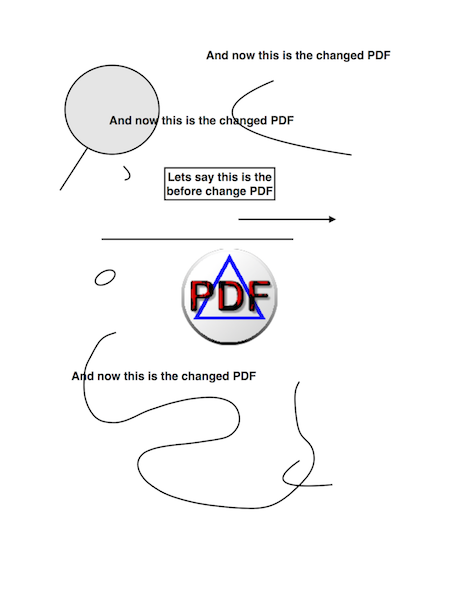
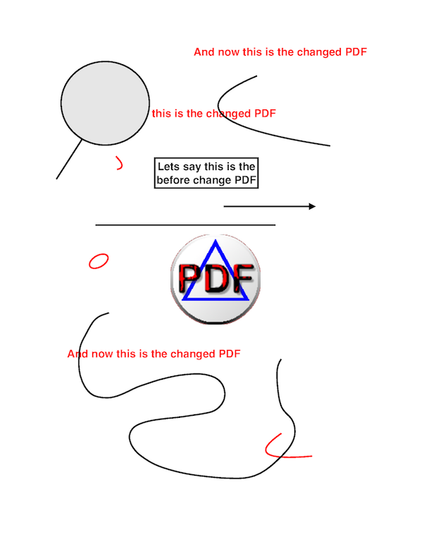

# PDF-DIFFERENCE-

- PDF-Difference uses both ImageMagick and GhostScript to combine the contents of two PDF
files such that the differences between the two show in the color red.

- The application is intended for use with pairs of PDF construction drawing plan sheets of the shame sheet number where one plan sheet contains revisions that may not be documented. The application combines the information from the two sheets. What is different between the sheets shows up in the color red.




### Use

- The application requires both ImageMagick and GhostScript to have been installed on the running computer in their standard install locations.
- The application also requires Microsoft.WindowsAPICodePack.dll, Microsoft.WindowsAPICodePack.Shell.dll, itextsharp.dll and itextsharp.xml to be in the folder where the executable PDF-DIFFERENCE.exe resides.
- The AlreadyBuilt folder contains the executable file and the other files mentioned above it needs to run.
- The user interface uses drag and drop for adding to the files lists. Double clicking opens a file browser.

### Example

Say the before PDF looks like this:



And the after PDF looks like this:



Then PDF-DIFFERNCE results look like this:



PDF-DIFFERNCE creates a log file of what it did. The log contains the ImageMagick commands executed in the process. GhostScript is used internally from ImageMagick for some of the process steps.

```
2/16/2018 3:23:04 PM
Stage: 1  Image: back_PDF_Delta_After.png

convert -density 200x200 -fill red -opaque black -fuzz 75% +antialias  "E:\VSProjects\Other\GitHub\PDF-DIFFERENCE\AlreadyBuilt\PDF_Delta_After.pdf" "E:\VSProjects\Other\GitHub\PDF-DIFFERENCE\AlreadyBuilt\back_PDF_Delta_After.png"


2/16/2018 3:23:06 PM
Stage: 2  Image: front_PDF_Delta_Before.png

convert -density 200x200 -transparent white -fuzz 00% +antialias  "E:\VSProjects\Other\GitHub\PDF-DIFFERENCE\AlreadyBuilt\PDF_Delta_Before.pdf" "E:\VSProjects\Other\GitHub\PDF-DIFFERENCE\AlreadyBuilt\front_PDF_Delta_Before.png"


2/16/2018 3:23:07 PM
Stage: 3  Image: Composite_PDF_Delta_After_and_PDF_Delta_Before.png

composite  "E:\VSProjects\Other\GitHub\PDF-DIFFERENCE\AlreadyBuilt\front_PDF_Delta_Before.png" "E:\VSProjects\Other\GitHub\PDF-DIFFERENCE\AlreadyBuilt\back_PDF_Delta_After.png" "E:\VSProjects\Other\GitHub\PDF-DIFFERENCE\AlreadyBuilt\Composite_PDF_Delta_After_and_PDF_Delta_Before.png"


2/16/2018 3:23:08 PM
Stage: 3  Image: Composite_PDF_Delta_After_and_PDF_Delta_Before.png

convert "E:\VSProjects\Other\GitHub\PDF-DIFFERENCE\AlreadyBuilt\Composite_PDF_Delta_After_and_PDF_Delta_Before.png" -background white -alpha remove -alpha off  "E:\VSProjects\Other\GitHub\PDF-DIFFERENCE\AlreadyBuilt\Composite_PDF_Delta_After_and_PDF_Delta_Before.png"


2/16/2018 3:23:08 PM
Stage: 4  Finshing: Composite_PDF_Delta_After_and_PDF_Delta_Before.pdf

convert  "E:\VSProjects\Other\GitHub\PDF-DIFFERENCE\AlreadyBuilt\Composite_PDF_Delta_After_and_PDF_Delta_Before.png" "E:\VSProjects\Other\GitHub\PDF-DIFFERENCE\AlreadyBuilt\Composite_PDF_Delta_After_and_PDF_Delta_Before.pdf"


2/16/2018 3:23:09 PM
Stage: 5  Completed: Composite_PDF_Delta_After_and_PDF_Delta_Before.pdf


2/16/2018 3:23:10 PM
Done creatings PDF difference image files.
```
